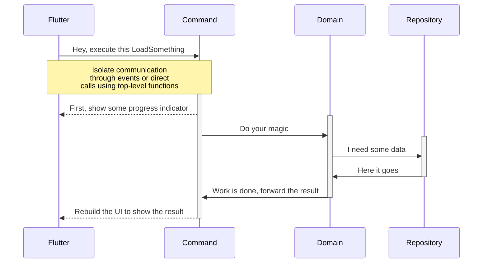

# EVent-drive Architecture for SOLID Flutter applications


## Features

* Automatic multithreading - Flutter runs on its isolate while the event orchestrator, your domain code and your repositories run on a separate isolate.

* Separation of concerns - Clear separation between UI orchestration (which UI event triggers a domain response), unit testable business logic in domain classes that uses data-driven repositories (local databases, APIs, etc.)

* Built-in dependency injection system - All layers are configurated through simple dependency injection, so you can inject whatever you need in your constructors (for example: use a `SomeClass` whenever someone asks for a `IInterfaceOfSomeClass`)

* Built-in environments - All dependency injection configuration resides in environment classes, so you can have `DevelopmentEnvironment` with one setting and `ProductionEnvironment` with other settings. You can have as many environments as you want.

* No code-generation required - Eva runs with one single line of code: `Eva.useEnvironment(() => const YourEnvironmentClass())`

* No boiler-plate - Aside from dependency injection, there is no framework-related code (aka boiler-plate)

* Unit test friendly - Your domain classes are pure and can be safely tested

* No exceptions thrown - Repositories and events works with a functional stateful response with `empty`, `waiting` (events only), `success(value)` and `failure(exception)` with functional handlers (such as `.map`, `.match`, `.maybeMatch`). No more `try/catch`!

* No nulls - Repositories and events have a special state called `empty` for empty values.

* Automatic loading handling - Events have a `waiting` state, so the UI can show some progress indicators while the domain is busy doing its stuff.

* Event builders - Widgets that respond to events, with automatic `empty` (blank), `waiting` (CircularProgressIndicator), `failure` (FlutterError) and `success` builders, so no `if/switch` is required to decide what to build in response to a domain call. You can even set your own custom widget for each kind of response.

* Event-driven: the UI emits `Command`, which is handled by your code (whenever a TCommand is dispatched, what you wanna do?), call your domain and dispatch events to be listened to by the Flutter UI.

## Clean Architecture



## Suggested project organization

```
📁 lib
├─ 📁 app
│  ├─ 📁 commands
│  │  └─ 📄 some_command.dart
│  ├─ 📁 contracts
│  │  └─ 📄 i_repo_interface.dart
│  ├─ 📁 domain
│  │  └─ 📄 some_domain.dart
│  ├─ 📁 entities
│  │  └─ 📄 freezed_entity.dart
│  ├─ 📁 environments
│  │  ├─ 📄 base_environment.dart
│  │  ├─ 📄 development_environment.dart
│  │  └─ 📄 production_environment.dart
│  ├─ 📁 presentation
│  │  ├─ 📁 pages
│  │  │   └─ 📄 home_page_widget.dart
│  │  └─ 📄 your_app.dart
│  ├─ 📁 repositories
│  │  ├─ 📁 data
│  │  │  └─ 📄 some_repository_specific_dto.dart
│  │  └─ 📄 sqlite_repository.dart
└── main.dart
```

Your Flutter code is kept as pure as possible, there is no need for `InheritedWidget` or some obtrusive widget, other than an `EventBuilder<T>` that listens to some event.

You write some domain class (a pure class that only handles business logic - given any input, call your repositories (if needed) and then respond with some output)

You register your domains and repositories within an `Environment` class (you can have as many environments as you want, test, development, homologation, production, beta, etc. and they only differ where they need, such as API URLs or keys, fake repositories for Unit Tests, etc.):

```dart
void registerDependencies() {
  registerDependency<AgeCalculatorDomain>((required, platform) => 
    AgeCalculatorDomain(
      ageRepository: required<IAgeRepository>(),
    ),
  );

  registerDependency<IAgeRepository>((required, platform) => 
    APIAgeRepository(
      url: "some url setting for this environment",
      apiKey: "whatever you need to make your boat float",
    ),
  );
}
```

When you need something from your domain code, you emit a command:

```dart
Eva.dispatch(CalculateMyAgeCommand(myBirthday: DateTime(1955, 10, 28));
```

Eva will transfer the `CalculateMyAgeCommand` class to the domain isolate and call the `Stream<IEvent> handle(required, platform) async *` method that will handle this command.

Handling a command means responding with one or more events that will be relayed to the appropriate `EventBuilder<TEvent>`.

If you want some progress indicator to be built into your UI, you can dispatch an event like this:

```dart
yield const Event<MyAgeEvent>.waiting();
```

Every `EventBuilder<MyAgeEvent>` will then run the `.buildWaiting(context, event)` method (if you ignore this property, it will render the default widget for a waiting event: a `Center(child: CircularProgressIndicator.adaptive())`).

Then, you need to get the instance of your domain (remember you registered it in your environment):

```dart
final myDomain = required<AgeCalculatorDomain>();
```

Your AgeCalculatorDomain requires a repository, but that was handled by the dependency injection, suited for your current environment.

So, you just use your domain:

```dart
final response = await myDomain.callApiToCalculateAge(myBirthday); 
// myBirthday was passed in your command constructor, remember?
```

Your repository can really return anything, but we recommend you to use the `Response<T>` functional class, so you can avoid writing `try/catch` or deal with `null` values. They also can be translated to an event with a single line of code (with automatic forwarding of `empty` and `failure` states):

```dart
return response.mapToEvent<AgeCalculatorEvent>(
  success: (value) => Event.success(AgeCalculatorResponse(myAge: age)),
);
```

So, in your UI, every `EventBuilder<AgeCalculatorResponse>` found in your widget tree (or in future widget trees) will rebuild itself with that value.

For full details about using Eva, check the example project: it is a fully functional to-do app using Isar database, with some unit tests, all pretty well commented so you can understand the easy-to-use Eva framework.

## How to handle `null` and `Exception`?

Both `Response<T>` and `Event<T>` have some nice functional methods so you can always return something or run some code, depending on the type of response/event:

```dart
Event<SomeClass> event;

event.match(
  success: (someclassInstance) => 'run some code here in case of success',
  failure: (exception) => 'do something with that exception',
  empty: () => 'the result is null or List.empty, so do something with that',
  waiting: () => 'the command is waiting for a response, wanna do something?',
);

Response<SomeClass> response;

final newResponse = response.map<String>(
  success: (someClassInstance) => Response.success(someClassInstance.someStringProperty),
);

// newResponse has the same empty or failure of the original, but, in case of
// success, it will create a Response<String> with the value of someStringProperty
```

The `EventBuilder<T>` have special handlers for each type of event state (both for running code, such as navigation, snack bars, alerts, etc. and widget building).

# `EventBuilder<T>` vs `CommandEventBuilder<C, T>`

They are the same, but `CommandEventBuilder<C, T>` will first dispatch a command `C`, then listen to the events of `T`. (You can use this to load some data and then listen to those results with only 1 line of code)

Event builders have also filters (so you can listen to some entity with a specific ID, for example) and some other cool well-documented properties.

# Dependencies

This package uses:

* [kfx_dependency_injection](https://pub.dev/packages/kfx_dependency_injection) 1.5.1
* [meta](https://pub.dev/packages/meta) 1.8.0
* [rxdart](https://pub.dev/packages/rxdart) 0.27.7

# Need some help, have some bug or contribution?

I'm happy to make this framework awesome with your contribution, so, [just open an issue](https://github.com/JCKodel/eva/issues).
