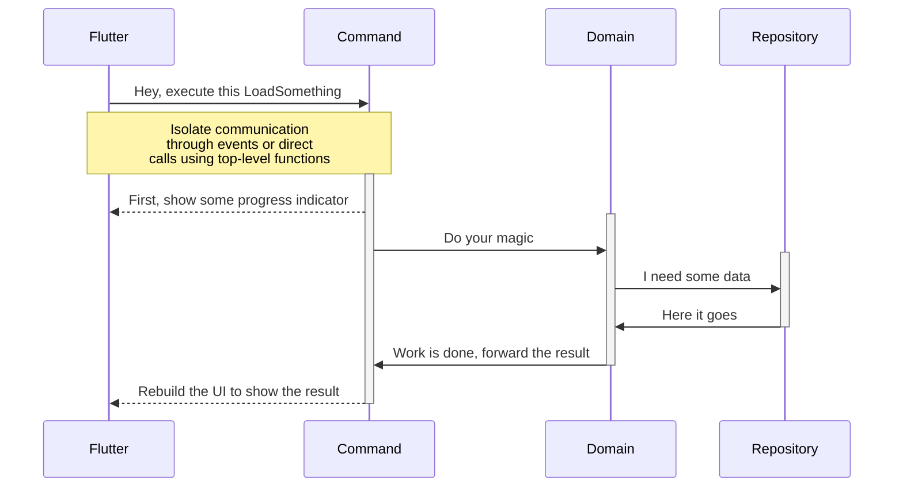

# EVent-driven Architecture for SOLID Flutter applications

## Features

* Automatic multithreading - Flutter runs on its isolate while the event orchestrator, your domain code and your repositories run on a separate isolate.

* Separation of concerns - Clear separation between UI orchestration (which UI event triggers a domain response), unit testable business logic in domain classes that uses data-driven repositories (local databases, APIs, etc.)

* Built-in dependency injection system - All layers are configurated through simple dependency injection, so you can inject whatever you need in your constructors (for example: use a `SomeClass` whenever someone asks for a `IInterfaceOfSomeClass`)

* Built-in environments - All dependency injection configuration resides in environment classes, so you can have `DevelopmentEnvironment` with one setting and `ProductionEnvironment` with other settings. You can have as many environments as you want.

* No code-generation required - Eva runs with one single line of code: `Eva.useEnvironment(() => const YourEnvironmentClass())`

* No boiler-plate - Aside from dependency injection, there is no framework-related code (aka boiler-plate)

* Unit test friendly - Your domain classes are pure and can be safely tested

* No exceptions thrown - Repositories and events works with a functional stateful response with `empty`, `waiting` (events only), `success(value)` and `failure(exception)` with functional handlers (such as `.map`, `.match`, `.maybeMatch`). No more `try/catch`!

* No nulls - Repositories and events have a special state called `empty` for empty values.

* Automatic loading handling - Events have a `waiting` state, so the UI can show some progress indicators while the domain is busy doing its stuff.

* Event builders - Widgets that respond to events, with automatic `empty` (blank), `waiting` (CircularProgressIndicator), `failure` (FlutterError) and `success` builders, so no `if/switch` is required to decide what to build in response to a domain call. You can even set your own custom widget for each kind of response.

* Event-driven: the UI emits `Command`, which is handled by your code (whenever a TCommand is dispatched, what you wanna do?), call your domain and dispatch events to be listened to by the Flutter UI.

## Clean Architecture

(the following chart is available only on GitHub, as pub.dev doesn't support [mermaid.js](https://mermaid.js.org/) markdown yet)



## Suggested project organization

```
📁 lib
├─ 📁 app
│  ├─ 📁 commands
│  │  └─ 📄 some_command.dart
│  ├─ 📁 contracts
│  │  └─ 📄 i_repo_interface.dart
│  ├─ 📁 domain
│  │  └─ 📄 some_domain.dart
│  ├─ 📁 entities
│  │  └─ 📄 freezed_entity.dart
│  ├─ 📁 environments
│  │  ├─ 📄 base_environment.dart
│  │  ├─ 📄 development_environment.dart
│  │  └─ 📄 production_environment.dart
│  ├─ 📁 presentation
│  │  ├─ 📁 pages
│  │  │  └─ 📄 home_page_widget.dart
│  │  └─ 📄 your_app.dart
│  ├─ 📁 repositories
│  │  ├─ 📁 data
│  │  │  └─ 📄 some_repository_specific_dto.dart
│  │  └─ 📄 sqlite_repository.dart
└── main.dart
```

## Let's build a to-do example

The source code is available in the `examples` folder.

## [main.dart](https://github.com/JCKodel/eva/blob/199c24cd6ab9ebaf98285fd4470fd52a6df735ae/example/lib/main.dart#L30)

```dart
Future<void> main() async {
  // STEP#1:
  // We pick an environment based on the current debug/release mode
  // and ask Eva to use it (check any of the classes below to
  // see what they do. In this example, they are the same,
  // except for the minLogLevel.
  //
  // Sometimes, the only difference between development and
  // production is an URL (so each class can have a
  // `String get serverUrl;` so each environment can determine
  // to which API to point).
  //
  // You can have as many environments as you want, such as test,
  // development, homologation, production, beta, etc.
  await Eva.useEnvironment(() => kDebugMode ? const DevelopmentEnvironment() : const ProductionEnvironment());

  // That's it. Eva requires only the one line of code above.
  runApp(const ToDoApp());
}
```

## [app/environments/development_environment.dart](https://github.com/JCKodel/eva/blob/199c24cd6ab9ebaf98285fd4470fd52a6df735ae/example/lib/app/environments/development_environment.dart)

Environment classes serve a single purpose: to register dependencies and initialize stuff (in the domain thread).

You use them when you have different implementations of repositories (i.e.: a real database for dev/prod, but a fake in-memory database for unit tests), or different settings (i.e.: you can have a base Environment with all dependencies, and then change only an URL in the dev/prod environment classes, pointing your code to different servers)

```dart
/// This is a base class (it's YOUR code) to register dependencies
/// that are shared among all environments, just for the sake of DRY
import 'base_environment.dart';

/// This is the environment used for development, using a real database
///
/// This is inherited from BaseEnvironment because there are common things
/// between all environments, so, the best practice is to register anything
/// common to all environments and then only override and specialize what
/// is needed for the new environment
@immutable
class DevelopmentEnvironment extends BaseEnvironment {
  const DevelopmentEnvironment();

  /// Default `minLogLevel` for Eva is `LogLevel.debug`, so
  /// we are specifiying we want more log here
  @override
  LogLevel get minLogLevel => LogLevel.verbose;

  /// STEP#2:
  /// This is the first method Eva calls and you should only register your
  /// dependencies here. We use the `kfx_dependency_injection` package
  /// and all dependencies will be registered as a singleton (so, don't
  /// keep states in your dependencies)
  ///
  /// Usually, here we say which class will be returned whenever we ask for
  /// a repository contract (since this is a base class for all our environments,
  /// except test, we're returning the Isar database repositories)
  ///
  /// For example: if you have a repository that handles API calls, you could
  /// either create a `DevelopmentAPIRepository`, with a String pointing to
  /// your dev API server and a `ProductionAPIRepository` with an URL pointing
  /// to your production server, or you can just create an `APIRepository` that
  /// receives a URL as a parameter and configures that argument inside your dev,
  /// homolog, prod, etc. environments using, for example,
  /// `(required, platform) => APIRepository(serverUrl: "https://example.com")`
  @override
  void registerDependencies() {
    // Notice that you MUST call `super.registerDependencies` and Dart will
    // remind you (if you configure analysis correctly) because `Environment`
    // has a `@mustCallSuper` meta-annotation on it. We recommend using the
    // `analysis_options.yaml` file provided by this project so you can get
    // all warnings for best practices.
    super.registerDependencies();

    // A dependency registration is pretty easy:
    // Here, whenever someone requires an `IAppSettingsRepository` (an abstract
    // empty class, i.e. an interface), an `IsarAppSettingsRepository` will be
    // returned (this class implements the interface above). Think of this as
    // plugins: you can choose whatever an environment returns from a need for
    // a type, depending on your environment needs (for instance: for unit
    // tests, you would not return a real database repository)
    registerDependency<IAppSettingsRepository>(
      (required, platform) => IsarAppSettingsRepository(),
    );

    registerDependency<IToDoRepository>(
      (required, platform) => IsarToDoRepository(),
    );
  }

  /// STEP#3:
  /// This method runs just after the `registerDependencies` above, and
  /// it allows you to initialize things before anything.
  ///
  /// Here, we are calling our repositories because the Isar database
  /// requires some initialization.
  ///
  /// Here is the place to run database migrations or read some initial
  /// values from platform plugins (such as GPS, FirebaseAnalytics, etc.).
  ///
  /// Of course, this initialization isn't required, so you just can
  /// ignore it if you don't have any initialization.
  @override
  Future<void> initialize(required, platform) async {
    await Future.wait([
      required<IAppSettingsRepository>().initialize(),
      required<IToDoRepository>().initialize(),
    ]);
  }
}
```

## [app/domain/settings_domain.dart](https://github.com/JCKodel/eva/blob/199c24cd6ab9ebaf98285fd4470fd52a6df735ae/example/lib/app/domain/settings_domain.dart)

Domains are pure classes (meaning they don't know anything outside them, no Flutter, no Repositories (except for its contracts)). As they only deal with pure input and outputs, you can safely test them in unit tests (as long as you mock your repositories or implement them using some fake methods, because unit tests shouldn't hit databases, APIs, etc.)

```dart
/// STEP#4
/// A Domain class is a singleton class that holds all your business logic.
///
/// This class should not know anything about Flutter-related things and also
/// can only communicate with other domain classes or with repositories (but
/// ONLY using contracts in this case).
///
/// This class should be tested in your unit tests, without any kind of modification.
///
/// So, write your tests first, then your domain classes to fulfil the tests, and then
/// your real-world repositories.
///
/// Since this domain will handle Settings related actions, it requires an
/// `IAppSettingsRepository` which is kindly provided by our environment in the
/// previous steps.
///
/// In this example, all domains are const (stateless), but this is not a rule.
///
/// Since domains are singletons (i.e.: you are always working in the same instance,
/// you can save a state (for example, some API key or some global wide-app state)
@immutable
class SettingsDomain implements IDomain {
  // You don't really need to, but since the `IAppSettingsRepository` is only used
  // inside this class, then we're setting it as a private variable (otherwise, this
  // repository would be visible from other domains, which can lead to unexpected
  // results, since we don't really know what kind of `IAppSettingsRepository` was
  // intended to be injected and used elsewhere.
  //
  // So, best practice: make your injections private
  const SettingsDomain({required IAppSettingsRepository appSettingsRepository}) : _appSettingsRepository = appSettingsRepository;

  final IAppSettingsRepository _appSettingsRepository;

  //Best practice: magic strings should only be defined once and have a descriptive name
  static const String kDarkThemeSettingValue = "D";
  static const String kLightThemeSettingValue = "L";

  /// Every domain is initializable, but we don't have anything here to
  /// initialize, so, we just ignore it.
  ///
  /// This method runs once and only once when the dependency injection
  /// is creating the singleton instance of this class.
  @override
  void initialize() {}

  // Best practice: don't repeat strings (if you need to change this key name,
  // you should do the change in only one place)
  static const kBrightnessKey = "themeBrightness";

  /// Get if we should use a dark (`true`) or light (`false`) theme
  /// from the app settings.
  Future<Response<bool>> getThemeIsDark() async {
    // We get our settings from the repository...
    final setting = await _appSettingsRepository.get(kBrightnessKey);

    /// ...then map that result, meaning: if anything that is not a success
    /// (failure or empty), we return it unchanged. Just in the case of a
    /// success response, we convert it, because our repository will return
    /// a String ("D" or "L") and we need to convert it to our response
    /// requirement, which is `true` for dark mode, and `false` for light.
    return setting.map(success: (value) => Response.success(value == kDarkThemeSettingValue));
  }

  /// Saves the specified theme provided by `isDarkTheme`.
  ///
  /// Notice that we NEED to always provide a response type, so,
  /// whenever you don't need any response, create one that will
  /// at least make sense (in this case, it will return the same
  /// `isDarkTheme` provided). This is needed because it is not
  /// possible to create a non-null value for `void` and Dart
  /// is not very good at handling generics.
  Future<Response<bool>> setThemeIsDark(bool isDarkTheme) async {
    /// We just send a "D" or an "L" for our repository to be saved
    /// in the app settings
    final response = await _appSettingsRepository.set(
      kBrightnessKey,
      isDarkTheme ? kDarkThemeSettingValue : kLightThemeSettingValue,
    );

    // We don't really care about the response, but it needs to be `<bool>`
    // so we map whatever the `set` method gave us to `isDarkTheme`.
    return response.map(success: (value) => Response.success(isDarkTheme));
  }

  // Best practice: don't repeat strings (if you need to change this key name,
  // you should do the change in only one place)
  static const kListToDosFilter = "listToDosFilter";

  /// Get the last used `ListToDosFilter` or `ListToDosFilter.all` if
  /// one was never used before.
  Future<Response<ListToDosFilter>> getListToDosFilter() async {
    // This will return a String (because that's all our repository can handle)
    final setting = await _appSettingsRepository.get(kListToDosFilter);

    return setting.map(
      // On success, we try to convert the String provided by the repository to the
      // one of `ListToDosFilter` values. You don't need to worry about exceptions
      // here, because, if one happens (for example the String returned by the
      // repository doesn't exist anymore, so this code will throw an
      // `IterableElementError.noElement` exception)
      success: (value) => Response.success(ListToDosFilter.values.firstWhere((v) => v.toString() == value)),

      // If the repository says that nothing exists for the `kListToDosFilter` setting,
      // we override the empty to a default setting of `ListToDosFilter.all`.
      //
      // This is a business rule (the default to-dos list filter is `all`), so you can
      // ONLY write this here, in a Domain class.
      empty: () => const Response.success(ListToDosFilter.all),
    );
  }

  /// Saves the current `ListToDosFilter`.
  Future<Response<ListToDosFilter>> setListToDosFilter(ListToDosFilter filter) async {
    final response = await _appSettingsRepository.set(kListToDosFilter, filter.toString());

    // Same case as above: we don't really care about the response, so we just
    // map the repository response to one that makes sense here (since we NEED
    // to return something)
    return response.map(success: (value) => Response.success(filter));
  }
}
```

## [app/contracts/i_app_settings_repository.dart](https://github.com/JCKodel/eva/blob/199c24cd6ab9ebaf98285fd4470fd52a6df735ae/example/lib/app/contracts/i_app_settings_repository.dart)

The repository pattern is simple:

1) They deal with data. That data can come from local databases, shared_preferences, remote Web APIs, GraphQL, files, etc. If you need some `async` code to read some data, it goes into a repository. The suggestion here is: if you need `async` AT ALL, put that code on a repository (that means using packages that have platform-specific code, such as GPS, path_provider, notifications, etc.). Notice that platform access outside the main isolate will only work in Flutter 3.7!

2) Repositories must be plugins. The domain layer only knows the repository through an interface (an abstract class with nothing but abstract methods). So, in a unit test environment, you can mock or fake your repository so it won't call any code that will have side effects, such as databases, APIs, etc. There are some nice packages out there, such as mockito, where you can easily mock your repositories and safely do your unit tests (check step 13 to see mockito and Eva in action)

```dart
import 'package:eva/eva.dart';

/// STEP#5
/// A contract is an interface (in Dart, abstract class without ANY
/// concrete code, just abstract methods and get/set accessors) that
/// says "any kind of repository implemented using this contract will
/// allow you to do these operations, no matter what kind of concrete
/// implementation it is"
///
/// This particular contract is for read/write app settings (think of
/// shared_preferences). Here we will use an Isar Database because it
/// is already used for the to-dos, so no need to use another package
/// to store user settings
///
/// These settings are basically: you are using a dark or light theme
/// and what was the last filter used in the to-do list.
///
/// Notice that all methods return a `Response<T>`. This special class
/// handles null values (`Response.empty`), exceptions (`Response.failure`)
/// and values (`Response.success`), so you never need to worry
/// about null values or exceptions and, as a bonus, you will write
/// much less `if` statements.
///
/// For example: if a setting key doesn't exist, instead of returning
/// a null String, we just return a `Response<String>.empty()`.
///
/// Check the `Response` class for more information.
@immutable
abstract class IAppSettingsRepository implements IRepository {
  /// Saves the `value` in the `key` app setting.
  Future<Response<String>> set(String key, String value);

  /// Retrieve the value saved in the specified `key`.
  Future<Response<String>> get(String key);
}
```

## [app/domain/to_do_domain.dart](https://github.com/JCKodel/eva/blob/199c24cd6ab9ebaf98285fd4470fd52a6df735ae/example/lib/app/domain/to_do_domain.dart)

Uncle Bob, the creator of Clean Architecture, states that domains are classes and they have single responsibility. But, this is a suggestion, not a rule.

In this example, I'm using the class to group features of my app (there are two of them: app settings and to-dos) and the methods are the use cases.

But this is also only a suggestion. Eva doesn't really care how you arrange your code. So, you are free to do whatever you want.

BTW, it's totally ok for one domain to depend on another. For example, the to-do domain need to deal with app settings, so it will call the app settings domain to do so (never the repositories, since the business logic MUST be in the domain, so you need to only use 3rd party domains or repositories that you know of (its contract is known to your domain)).

```dart
import 'package:eva/eva.dart';
import '../contracts/i_to_do_repository.dart';
import '../entities/to_do_entity.dart';

import 'settings_domain.dart';

/// STEP#6
/// Handles all business logic related to to-dos, except the ones that are related to app settings.
@immutable
class ToDoDomain implements IDomain {
  const ToDoDomain({required IToDoRepository toDoRepository, required SettingsDomain settingsDomain})
      : _toDoRepository = toDoRepository,
        _settingsDomain = settingsDomain;

  final IToDoRepository _toDoRepository;
  final SettingsDomain _settingsDomain;

  @override
  void initialize() {}

  /// Returns a list of all to-dos, based on the saved filter.
  Future<Response<Iterable<ToDoEntity>>> listToDos() async {
    // Notice that we are asking the filter to the SettingsDomain, because
    // it knows how to handle the default case.
    //
    // Don't repeat business logic in multiple places, instead, inject another
    // domain and call it whenever you need to.
    final filterResponse = await _settingsDomain.getListToDosFilter();

    // If the `getListToDosFilter` returned empty or failure, it will be returned
    // here without any changes. We just need to handle the success case:
    return filterResponse.mapAsync(
      // `filter` is the current filter returned by the `getListToDosFilter` above
      success: (filter) async {
        // Now that we know what filter to use, we can list our to-dos:
        final response = await _toDoRepository.listToDos(filter);

        // Since ordering and filtering are much better handled by databases,
        // we won't build that here. It's a domain violation (because this method
        // SHOULD return a filtered list of to-dos), but it would be impractical
        // to filter a big list here. Sometimes rules must be bent.

        return response.map(
          // An empty list is an empty result, and we're not sure if the repository
          // will actually consider this rule, so we are emphasizing it here:
          // if the list of to-dos is empty, we return an empty result (because in the UI,
          // an empty result will show a different widget than the list)
          success: (value) => value.isEmpty ? const Response<Iterable<ToDoEntity>>.empty() : Response<Iterable<ToDoEntity>>.success(value),
        );
      },
    );
  }

  // This will start the edition of a to-do. It will store the old value
  // and wrap the editing toDo, the original toDo and all validation errors
  // inside a `EditingToDoEntity`. This will allow us to check if the to do
  // was modified in the edit/new to do page (to handle WillPopScope) and
  // also will validate the to-do entity whenever it changes.
  Future<Response<EditingToDoEntity>> startEditingToDo(int? toDoId) async {
    if (toDoId == null) {
      // If the to-do id is null, then we are using the [+] button to create a new one.
      final emptyToDo = ToDoEntity(
        title: "",
        description: "",
        creationDate: DateTime.now(),
        completed: false,
      );

      // Since this code is the same in this method, we will extract it
      // to a function to not repeat ourselves.
      return _wrapToDo(emptyToDo);
    }

    // We get here when the `toDoId` is not null, so we need to actually
    // load the specified to-do from the database before editing it.

    final currentToDo = await _toDoRepository.getToDoById(toDoId);

    // Since the arguments required by `success` matches the arguments
    // required by `_wrapToDo`, we can just use this shortcut instead of
    // writing `success: (toDo) => _wrapToDo(toDo)`
    return currentToDo.map(success: _wrapToDo);
  }

  /// This is a simple DRY (Don't Repeat Yourself) function to
  /// wrap a to-do inside an `EditingToDoEntity`.
  Response<EditingToDoEntity> _wrapToDo(ToDoEntity toDo) {
    return Response.success(
      EditingToDoEntity(
        originalToDo: toDo.copyWith(),
        toDo: toDo,
        // This initial validation will add all errors an empty to-do has,
        // so our UI will show them before you start to edit the new to-do.
        validationFailures: validateToDo(toDo),
      ),
    );
  }

  /// Validates a to-do and returns a list of failures or an empty list if
  /// all is ok.
  Iterable<ToDoValidationFailure> validateToDo(ToDoEntity toDo) {
    final validationFailures = <ToDoValidationFailure>[];

    // To-dos cannot have an empty title.
    if (toDo.title == "") {
      validationFailures.add(ToDoValidationFailure.titleIsEmpty);
    }

    // To-dos cannot have an empty description.
    if (toDo.description == "") {
      validationFailures.add(ToDoValidationFailure.descriptionIsEmpty);
    }

    return validationFailures;
  }

  /// Saves an editing to-do.
  Future<Response<ToDoEntity>> saveEditingToDo(EditingToDoEntity editingToDo) async {
    // Best practice: Never trust the UI or the call chain: validate again before saving.
    final validationFailures = validateToDo(editingToDo.toDo);

    // The UI will have to check for this specific failure
    if (validationFailures.isNotEmpty) {
      return Response.failure(validationFailures);
    }

    late Response<ToDoEntity> response;

    if (editingToDo.toDo.id == null && editingToDo.toDo.completed) {
      // Best practice: We can't trust the repository to actually set the
      // `completionDate` whenever the to-do is completed, so we are doing
      // this here (as well?)
      response = await _toDoRepository.saveToDo(editingToDo.toDo.copyWith(completionDate: DateTime.now()));
    } else {
      response = await _toDoRepository.saveToDo(editingToDo.toDo);
    }

    return response;
  }

  /// Since the UI allows a to-do to be marked as completed/uncomplete without actually editing it,
  /// we handle that here
  Future<Response<ToDoEntity>> setToDoCompleted({required int toDoId, required bool completed}) async {
    final currentToDo = await _toDoRepository.getToDoById(toDoId);

    return currentToDo.mapAsync(
      success: (toDo) async {
        if (toDo.completed == completed) {
          return Response.success(toDo);
        }

        // Again, don't trust the repository to set `completionDate` to now
        return _toDoRepository.saveToDo(
          toDo.copyWith(
            completed: completed,
            completionDate: completed ? DateTime.now() : null,
          ),
        );
      },
    );
  }

  /// Deletes a to-do, by its id.
  Future<Response<int>> deleteToDo({required int toDoId}) async {
    final response = await _toDoRepository.deleteToDoById(toDoId);

    // Again, we don't care about the result value (or even if the
    // to-do was deleted before and this is a non-op operation
    // because of it (deleting something that doesn't exists)),
    // since the UI will refresh after this change (or at least
    // we trust the UI business logic (`Command`) will do this)
    return response.map(success: (_) => Response.success(toDoId));
  }
}
```

## [app/contracts/i_to_do_repository.dart](https://github.com/JCKodel/eva/blob/199c24cd6ab9ebaf98285fd4470fd52a6df735ae/example/lib/app/contracts/i_to_do_repository.dart)

As Uncle Bob said, the domain is in the centre of your architecture, so it depends on no one to make its job (that's why they are so unit-test friendly). But, in the real world, this is impossible: the domain needs to call the repositories and thus needs to know about them.

Since repositories MUST BE treated as plugins, you must provide to the domain only a contract, so it will know what kind of operations it is capable of and it can ask for the dependency injection system the current most suitable concrete repository implementation, given only its contract. (This is literally the meaning of Polymorphism and Encapsulation).

In other languages, such as C#, you have a contract-only entity called interface. It contains only a description of the methods some class must have, but no code whatsoever. Then, you `implements` interfaces instead of extending classes with them.

Dart doesn't have a keyword for interfaces, but you can still create them using only abstract methods (methods without body) and make sure your repositories `implements` them (instead of `extends` them). Dart abstract classes used as interfaces CANNOT have ANY code whatsoever, not constructors, not variables (final or otherwise), nothing except abstract methods (methods without `{}`):

```dart
import 'package:eva/eva.dart';
import '../entities/list_to_dos_filter.dart';
import '../entities/to_do_entity.dart';

/// STEP#7
/// This is the contract for the ToDo repository.
@immutable
abstract class IToDoRepository implements IRepository {
  /// List all available to dos from database and return `empty` if there is
  /// no to dos available, `failure` for exceptions or a `Iterable<ToDoEntity>`
  /// with the results found using the specified `ListToDosFilter`.
  Future<Response<Iterable<ToDoEntity>>> listToDos(ListToDosFilter filter);
  
  /// Get a to-do by its id. Returns `empty` if none exists.
  Future<Response<ToDoEntity>> getToDoById(int id);

  /// Save a to-do, returning it with the `id` property filled.
  Future<Response<ToDoEntity>> saveToDo(ToDoEntity toDo);

  /// Delete a to-do by its id.
  Future<Response<bool>> deleteToDoById(int toDoId);
}
```

Now, for any repositories you build, you must implement these methods, with these signatures, so the Domain doesn't really care about what it will really do.

## [app/commands/load_theme_command.dart](https://github.com/JCKodel/eva/blob/199c24cd6ab9ebaf98285fd4470fd52a6df735ae/example/lib/app/commands/load_theme_command.dart)

Commands are classes that can have some argument and are sent to the domain isolate by Eva. They also are responsible to orchestrate what happens when it is dispatched.

It is important to remember this: the `handle` method of a command class is ALWAYS executed in the domain isolate!

They are very similar to a cubit/bloc: you have some command that will emit some events to a stream so an `EventBuilder<T>` will rebuild itself whenever those events are detected.

```dart
import 'package:eva/eva.dart';
import '../domain/settings_domain.dart';
import '../entities/to_do_theme_entity.dart';

/// STEP#8
/// Commands are messages sent from the main thread to the domain thread.
///
/// This command will be dispatched whenever we need to load the current
/// app theme (this will be dispatched by a `CommandEventBuilder<LoadThemeCommand, ToDoThemeEntity>`
/// widget that wraps the whole app)
///
/// Commands are instantiated when needed, so they are stateless
@immutable
class LoadThemeCommand extends Command {
  const LoadThemeCommand();

  /// This will handle the command (what will happen when this command is dispatched)
  ///
  /// IMPORTANT: this method will run on the domain thread, not on your UI thread!
  /// You cannot call anything here, except what is registered in your environments.
  ///
  /// Those methods exist for only one reason: to bridge and orchestrate the events
  /// between the domain thread and the UI (main) thread.
  ///
  /// IMPORTANT: the original method signature on the `Command` class is
  /// `Stream<IEvent> handle(RequiredFactory required, PlatformInfo platform)`.
  ///
  /// Notice the `Stream<IEvent>` form: it will allow you to yield any event you
  /// want, and this is completely fine if it makes sense to you, BUT, a common
  /// mistake observed while this app was being built is that sometimes we copy
  /// and paste code and forget to change things (in this particular case, I was
  /// firing (yielding) an event that was not related to what I wanted, because of
  /// the copy-paste, making my UI change to a waiting state of another event
  /// that would never trigger by this handler)
  ///
  /// So, to be safe and get errors before they happen, you can force the emission
  /// of just one kind of event by changing the signature to
  /// `Stream<Event<YourEventEntity>> handle...`, so the that observed mistake was
  /// not even possible anymore.
  ///
  /// Best practice: always change the `handle` signature to type your yielded events.
  @override
  Stream<Event<ToDoThemeEntity>> handle(required, platform) async* {
    // This works just like a BLoC pattern: this method is `async*`,
    // meaning it returns a stream of results.
    //
    // Our first result is a `waiting`, so the UI can show a widget
    // such as CircularProgressIndicator.
    //
    // Notice that since we changed our signature, Dart will be able to
    // infer that `Event.waiting()` is actually `Event<ToDoThemeEntity>.waiting()`.
    //
    // This is very important, because, without the proper analysis_options.yaml,
    // no warning will be issued if you try to create an `Event.waiting()` inside
    // a untyped method (`Event.waiting()` is `Event<dynamic>.waiting()`, but your
    // UI is specifically waiting for a `ToDoThemeEntity` event).
    //
    // If you don't mind the verbosity, always implicitly type your generic references
    // (`Event<ToDoThemeEntity>.waiting()`), so you get nice compilation errors.
    yield const Event.waiting();

    // You can get all types registered in the environment by using the `required` factory:
    final settingsDomain = required<SettingsDomain>();

    // Always call your domain and let it do all the business logic
    // (remember: a Command is only an orchestrator of events)
    final response = await settingsDomain.getThemeIsDark();

    // Since domains use `Response<T>` and commands use `Event<T>`, all responses have
    // this neat method to convert it to an event:
    yield response.mapToEvent(success: (isDarkTheme) => ToDoThemeEntity(isDarkTheme: isDarkTheme));
  }
}
```

## [app/repositories/isar/base_repository.dart](https://github.com/JCKodel/eva/blob/199c24cd6ab9ebaf98285fd4470fd52a6df735ae/example/lib/app/repositories/isar/base_repository.dart)

It is always a good idea to not repeat code (DRY - Don't Repeat Yourself), so it is considered a good practice to use class inheritance to write common shared code and then specialize (inherit) some classes so they can deal with specific details. That's what abstract classes are about: a base class that will have some code that will work fine for all classes that inherits it (if not, you can always `@override` something).

In this case, since both our repositories require Isar database initialization, and that initialization is idempotent (doesn't matter if you call it 100x times, it will only initialize once), we can write this initialization code in a base class:

```dart
import 'package:eva/eva.dart';
import 'package:isar/isar.dart';

import 'data/app_setting.dart';
import 'data/to_do.dart';

/// STEP#9
/// This is our real-world repository (for development and production environments).
///
/// This base shared repository does actions that are common amongst all repositories
/// used in this project, so, DRY (Don't Repeat Yourself)!
///
/// In this example, all repositories are const (stateless), but you can
/// make them stateful, if you wish (just keep in mind that those classes
/// are singleton, i.e.: they are instantiated only once)
///
/// A usefull stateful information in a repository is some API key or OAuth token
/// that is used throughout the app life-cycle.
@immutable
abstract class BaseRepository implements IRepository {
  @override
  Future<void> initialize() async {
    if (Isar.getInstance() == null) {
      await Isar.open(
        [AppSettingSchema, ToDoSchema],
        inspector: true,
        compactOnLaunch: const CompactCondition(minFileSize: 1024 * 1024),
      );
    }
  }
}
```

Notice that your repositories should NOT have any business logic (otherwise, it won't be testable). Unfortunately, in the real world, this is not always possible. For example in this example project, we need to filter and sort to-dos from the database, but it would be rather inefficient to do that in the domain code (since databases are far better suited to do so). So this is a business logic (the filter and sort order of our data) that cannot be implemented in our domain.

Be flexible and do what is better for your product!

## [app/presentation/to_do_app.dart](https://github.com/JCKodel/eva/blob/199c24cd6ab9ebaf98285fd4470fd52a6df735ae/example/lib/app/presentation/to_do_app.dart)

Now we use our command and events to build our to-do app. This is our app (a `MaterialApp`).

Tip: notice that Eva dependency injection has a `PlatformInfo`, which will tell you in what kind of device you are running, so you can also create your widgets platform-based (one for Cupertino, one for Material, one for Fluent (Windows), etc.) and them register them as dependencies and using the `PlatformInfo` to determine what kind of widget is returned when asked (so it will return a `CupertinoToDoApp` for iOS or a `MaterialToDoApp` for Android) if you wish.

```dart
import 'package:flutter/material.dart';

import 'package:eva/eva.dart';
import '../commands/load_theme_command.dart';
import '../entities/to_do_theme_entity.dart';

import 'home/home_page.dart';

/// STEP#10
/// This is the main app.
class ToDoApp extends StatelessWidget {
  const ToDoApp({super.key});

  @override
  Widget build(BuildContext context) {
    /// A `CommandEventBuilder<A, B>` will:
    ///
    /// 1) Dispatch the `A` command specified by `command`.
    ///
    /// 2) Listen to any `B` event.
    ///
    /// 3) Run onSuccess, onEmpty, onWaiting, onFailure or onOtherwise (if the previous didn't match) -
    ///    These methods return void and are meant to, for example, show an alert or snackbar.
    ///
    /// 4) Run successBuilder, emptyBuilder, waitingBuilder, failureBuilder or otherwiseBuilder (if the previous didn't match)
    ///    There are defaults of every method (except success): empty will render a `SizedBox`, failure will
    ///    render a red screen of death, waiting will render a `CircularProgressIndicator`.
    ///
    ///    You can override those defaults by changing `EventBuilder.defaultEmptyBuilder`,
    ///    `EventBuilder.defaultWaitingBuilder` or `EventBuilder.defaultFailureBuilder`.
    ///
    ///    Do NOT run anything except functions that returns a widget in a build method (this
    ///    is really required for all Flutter, not only EvA)
    return CommandEventBuilder<LoadThemeCommand, ToDoThemeEntity>(
      command: const LoadThemeCommand(),
      // Not sure if this should be handled here, but, while waiting for the
      // theme to load, just shows it using the current device theme brightness
      //
      // Here is a good point to hide the splash screen if you are using the
      //flutter_native_splash package, in `onOtherwise: (_, _)  => FlutterNativeSplash.remove()`
      otherwiseBuilder: (context, event) => _ToDoApp(isDarkTheme: WidgetsBinding.instance.window.platformBrightness == Brightness.dark),
      successBuilder: (context, event) => _ToDoApp(isDarkTheme: event.value.isDarkTheme),
    );
  }
}

/// Just a DRY for the actual app, since we have two separate paths on the code above
///
/// Notice that since Flutter is capable of calling platform code inside isolates
/// since 3.7, you should make all your calls to the platform channels in the domain
/// thread. We're not using any here, so...
///
/// Platform channels are packages that have native code (Java, Kotlin, Swift, Objective-C, etc.)
class _ToDoApp extends StatelessWidget {
  const _ToDoApp({required this.isDarkTheme});

  final bool isDarkTheme;

  @override
  Widget build(BuildContext context) {
    const themeColor = Colors.blue;

    return MaterialApp(
      color: themeColor,
      darkTheme: ThemeData(useMaterial3: true, colorSchemeSeed: themeColor, brightness: Brightness.dark),
      theme: ThemeData(useMaterial3: true, colorSchemeSeed: themeColor, brightness: Brightness.light),
      themeMode: isDarkTheme ? ThemeMode.dark : ThemeMode.light,
      title: "EvA To Do Example",
      home: const HomePage(),
    );
  }
}
```

## [app/presentation/home/home_page.dart](https://github.com/JCKodel/eva/blob/199c24cd6ab9ebaf98285fd4470fd52a6df735ae/example/lib/app/presentation/home/home_page.dart)

This is our home page:

```dart
import 'package:eva/eva.dart';
import 'package:flutter/material.dart';

// Tip: create a barrel index file to avoid so much imports, if you wish
import '../../commands/load_to_do_filter_setting_command.dart';
import '../../commands/load_to_dos_command.dart';
import '../../commands/save_theme_command.dart';
import '../../commands/set_editing_to_do_command.dart';
import '../../commands/set_to_do_filter_setting_command.dart';
import '../../entities/list_to_dos_filter.dart';
import '../../entities/to_do_theme_entity.dart';
import '../to_dos/edit_to_do.dart';
import '../to_dos/to_dos_list.dart';

/// STEP#11
/// This is the home page of the app
class HomePage extends StatelessWidget {
  /// Since we listen for events, all widgets can be stateless
  const HomePage({super.key});

  @override
  Widget build(BuildContext context) {
    // We really could listen to `Event<ToDoThemeEntity>` and rebuild this
    // widget when the theme changes, but this causes issues with hot reloading,
    // specifically: when you save this file in your IDE, the theme reverts
    // to light theme, because the event rebuild happens on the parent widget
    // and that was not triggered by the save.
    //
    // So, for each event builder (`CommandEventBuilder` or `EventBuilder`)
    // will wrap the builder in an `InheritedWidget`, so you can get the
    // emitted event whenever you want in the context:
    final toDoThemeEntityState = EventState.of<ToDoThemeEntity>(context);

    // We dispatch a `LoadToDoFilterSettingCommand` to get the current filter state...
    return CommandEventBuilder<LoadToDoFilterSettingCommand, ListToDosFilter>(
      /// ...that will be `all` if the current filter state is empty
      initialValue: ListToDosFilter.all,
      command: const LoadToDoFilterSettingCommand(),
      successBuilder: (context, listToDosFilterEvent) {
        // Best practice: is always a good idea to cache method calls
        final theme = Theme.of(context);

        return Scaffold(
          appBar: AppBar(
            title: const Text("EvA To Do"),
            actions: [
              // Every `Response<T>` or `Event<T>` has a `map` and `match`, so it will
              // make our 3/4 way `if` a lot easier:
              toDoThemeEntityState.state.maybeMatch(
                otherwise: (e) => _ThemeBrightnessCheckbox(isDarkTheme: WidgetsBinding.instance.window.platformBrightness == Brightness.dark),
                success: (e) => _ThemeBrightnessCheckbox(isDarkTheme: e.value.isDarkTheme),
              ),
            ],
            bottom: PreferredSize(
              preferredSize: const Size.fromHeight(kToolbarHeight),
              child: CheckboxListTile(
                tristate: true,
                controlAffinity: ListTileControlAffinity.leading,
                secondary: IconButton(
                  icon: Icon(Icons.refresh, color: theme.colorScheme.primary),
                  // Here we are dispatching a `LoadToDosCommand`, so Eva will
                  // call the command handler, which will call the domain, which
                  // will call the repository and give us a list of to-dos.
                  onPressed: () => Eva.dispatchCommand(const LoadToDosCommand()),
                ),
                // Our `SetToDoFilterSettingCommand` will dispatch the
                // `LoadToDosCommand`, so we don't need to repeat that
                // here
                onChanged: (newValue) => Eva.dispatchCommand(
                  SetToDoFilterSettingCommand(
                    filter: newValue == null
                        ? ListToDosFilter.all
                        : newValue
                            ? ListToDosFilter.completedOnly
                            : ListToDosFilter.uncompletedOnly,
                  ),
                ),
                value: listToDosFilterEvent.value == ListToDosFilter.all
                    ? null
                    : listToDosFilterEvent.value == ListToDosFilter.completedOnly
                        ? true
                        : false,
                title: Text(
                  listToDosFilterEvent.value == ListToDosFilter.all
                      ? "Show all"
                      : listToDosFilterEvent.value == ListToDosFilter.completedOnly
                          ? "Show completed only"
                          : "Show uncompleted only",
                ),
              ),
            ),
          ),
          body: ToDosList(
            listToDosFilter: listToDosFilterEvent.value,
          ),
          floatingActionButton: FloatingActionButton(
            onPressed: () => _openNewToDoPage(context),
            child: const Icon(Icons.add),
          ),
        );
      },
    );
  }

  void _openNewToDoPage(BuildContext context) {
    // Since events are (truly) assynchronous, we can request the
    // to-do loading and validation even before we do the actual
    // navigation to the edit screen.
    //
    // This will reduce the total waiting time because things will start
    // to load while the navigation animation is playing, but it will
    // also may cause some stuttering when the event changes from
    // waiting to success in the middle of the animation (so Flutter will
    // rebuild a potentially heavy widget while an animation is playing)
    //
    // It's your decision to make a dispatch here or inside the `EditToDo`
    // page itself (as long it is in a place that is executed only once,
    // either an `initState` method or before any `EventBuilder<T>`).
    Eva.dispatchCommand(const SetEditingToDoCommand(toDoId: null));
    Navigator.of(context).push(MaterialPageRoute<void>(builder: (context) => const EditToDo()));
  }
}

class _ThemeBrightnessCheckbox extends StatelessWidget {
  const _ThemeBrightnessCheckbox({required this.isDarkTheme});

  final bool isDarkTheme;

  @override
  Widget build(BuildContext context) {
    return Switch(
      thumbIcon: MaterialStateProperty.resolveWith<Icon?>(
        (Set<MaterialState> states) => isDarkTheme ? const Icon(Icons.light_mode) : const Icon(Icons.dark_mode),
      ),
      value: isDarkTheme,
      onChanged: (newValue) => Eva.dispatchCommand(SaveThemeCommand(isDarkTheme: newValue)),
    );
  }
}
```

## [app/presentation/to_dos/edit_to_do.dart](https://github.com/JCKodel/eva/blob/199c24cd6ab9ebaf98285fd4470fd52a6df735ae/example/lib/app/presentation/to_dos/edit_to_do.dart)

This is the to-do edition page and it has a final special Eva feature which is the ability to call the domain in its own isolate and wait for the response.

The only rule here is: those calls MUST be a static or top-level function (this is actually a Dart Isolate requirement: it cannot deal with closures that have non-isolatable objects (and Flutter is full of them)). If you have any issues using isolates, check the official Dart documentation on that matter: [Concurrency in Dart](https://dart.dev/guides/language/concurrency#:~:text=Using%20isolates%2C%20your%20Dart%20code,Dart%20Native%20platform%20implements%20isolates.).

```dart
import 'package:flutter/material.dart';

import 'package:eva/eva.dart';
import 'package:kfx_dependency_injection/kfx_dependency_injection/platform_info.dart';

import '../../commands/load_to_dos_command.dart';
import '../../commands/update_editing_to_do_command.dart';
import '../../domain/to_do_domain.dart';
import '../../entities/to_do_entity.dart';

/// STEP#12
/// This is our edit to-do page
///
/// This doesn't really need to be a stateless widget, but,
/// hey! why not?
///
/// The alternative is to build a StatefulWidget that holds
/// the title, description and completed and then just call
/// the domain to validate and save the data.
///
/// The way is done here is to actually call the domain for
/// each keystroke, running the validation and rebuilding
/// the form to show errors, etc.
class EditToDo extends StatelessWidget {
  const EditToDo({super.key});

  @override
  Widget build(BuildContext context) {
    // Since we dispatched our `EditingToDoEntity` event before
    // the code that navigates to this page, this event builder
    // will handle our events just fine
    //
    // IMPORTANT: Eva doesn't use regular streams (it uses the
    // `BehaviorSubject` of the `rxdart` package), so it really
    // doesn't matter if the `EventBuilder<T>` isn't ready yet
    // to receive events. `BehaviorSubject` will cache the
    // events and make sure that they will be ready in the future.
    return EventBuilder<EditingToDoEntity>(
      // This is an special case where the to-do doesn't
      // exist and we try to edit it
      onEmpty: (context, event) {
        ScaffoldMessenger.of(context).showSnackBar(
          const SnackBar(content: Text("To Do doesn't exist anymore!")),
        );

        Navigator.of(context).pop();
      },
      successBuilder: (context, event) => WillPopScope(
        onWillPop: () => _onWillPop(context, event.value),
        child: Scaffold(
          appBar: AppBar(
            title: Text("${event.value.toDo.id == null ? "New" : "Edit"} To Do"),
          ),
          body: SingleChildScrollView(
            child: Column(
              mainAxisSize: MainAxisSize.min,
              crossAxisAlignment: CrossAxisAlignment.stretch,
              children: [
                Padding(
                  padding: const EdgeInsets.fromLTRB(16, 16, 16, 0),
                  child: TextFormField(
                    initialValue: event.value.toDo.title,
                    decoration: InputDecoration(
                      label: const Text("Title"),
                      errorText: event.value.validationFailures.contains(ToDoValidationFailure.titleIsEmpty) ? "Title cannot be empty" : null,
                    ),
                    // Here we are dispatching an `UpdateEditingToDoCommand` with the same
                    // to-do entity, but with one property changed (since our entities are
                    // immutable)
                    //
                    // Mutables entities work just as well, and they are even easier (especially to
                    // check if the entity is dirty (i.e.: has non-saved changes)), but immutability
                    // will always win for maintainability in the long run.
                    onChanged: (value) => Eva.dispatchCommand(
                      UpdateEditingToDoCommand(editingToDo: event.value.copyWith.toDo(title: value)),
                    ),
                  ),
                ),
                Padding(
                  padding: const EdgeInsets.all(16),
                  child: TextFormField(
                    initialValue: event.value.toDo.description,
                    decoration: InputDecoration(
                      label: const Text("Description"),
                      errorText: event.value.validationFailures.contains(ToDoValidationFailure.descriptionIsEmpty) ? "Description cannot be empty" : null,
                    ),
                    minLines: 5,
                    maxLines: 5,
                    onChanged: (value) => Eva.dispatchCommand(
                      UpdateEditingToDoCommand(editingToDo: event.value.copyWith.toDo(description: value)),
                    ),
                  ),
                ),
                SwitchListTile.adaptive(
                  value: event.value.toDo.completed,
                  title: const Text("This to do is completed"),
                  onChanged: (value) => Eva.dispatchCommand(
                    UpdateEditingToDoCommand(editingToDo: event.value.copyWith.toDo(completed: value)),
                  ),
                ),
                Padding(
                  padding: const EdgeInsets.fromLTRB(16, 32, 16, 16),
                  child: FilledButton.tonalIcon(
                    onPressed: () => _saveToDo(context, event.value),
                    icon: const Icon(Icons.save_alt),
                    label: const Text("SAVE"),
                  ),
                ),
                if (event.value.toDo.id != null)
                  Padding(
                    padding: const EdgeInsets.fromLTRB(16, 0, 16, 16),
                    child: TextButton.icon(
                      onPressed: () => _deleteToDo(context, event.value.toDo.id!),
                      icon: const Icon(Icons.delete_forever, color: Colors.red),
                      label: const Text("DELETE", style: TextStyle(color: Colors.red)),
                    ),
                  ),
              ],
            ),
          ),
        ),
      ),
    );
  }

  Future<void> _saveToDo(BuildContext context, EditingToDoEntity editingToDo) async {
    // This `Eva.executeOnDomain` will call the static or top-level function
    // `_saveEditingToDoInDomain` method, passing the `editingToDo` to it
    //
    // Remember: this function will run on another thread, not here!
    //
    // Read the instructions on the `_saveEditingToDoInDomain` code!!!
    final response = await Eva.executeOnDomain(_saveEditingToDoInDomain, editingToDo);

    response.maybeMatch(
      otherwise: () {},
      success: (savingToDoEntity) {
        Navigator.of(context).pop();
        ScaffoldMessenger.of(context).showSnackBar(const SnackBar(content: Text("To Do saved")));

        // Since the list of all our to-dos has changed and we don't know the
        // current filter, we'll just trigger a refresh using `LoadToDosCommand`.
        //
        // It doesn't matter that the to-dos list is in another widget, because
        // the `EventBuilder` is (or will be) listening to all events of that
        // kind, whether the widget is active or not (or even if it doesn't
        // exist yet)
        Eva.dispatchCommand(const LoadToDosCommand());
      },
      failure: (exception) {
        // Now we must do a UI business logic here because a `failure` can be
        // an exception or just a list of validation failures.
        if (exception is Iterable<ToDoValidationFailure> == false) {
          // Unexpected exception? Crash our code!
          throw exception;
        }

        final theme = Theme.of(context);

        ScaffoldMessenger.of(context).showSnackBar(
          SnackBar(
            content: Text("There are errors requiring your attention!", style: TextStyle(color: theme.colorScheme.onErrorContainer)),
            backgroundColor: theme.colorScheme.errorContainer,
          ),
        );
      },
    );
  }

  Future<void> _deleteToDo(BuildContext context, int toDoId) async {
    final canDelete = await showDialog<bool>(
      context: context,
      builder: (context) => AlertDialog(
        title: const Text("Delete to do?"),
        content: const Text("Are you sure you want to delete this to do?"),
        actions: [
          TextButton(
            onPressed: () => Navigator.of(context).pop(false),
            child: const Text("Cancel"),
          ),
          TextButton(
            onPressed: () => Navigator.of(context).pop(true),
            child: const Text("Discard"),
          ),
        ],
      ),
    );

    if (canDelete == false) {
      return;
    }

    final response = await Eva.executeOnDomain(_deleteToDoInDomain, toDoId);

    response.maybeMatch(
      otherwise: () {},
      success: (id) {
        Navigator.of(context).pop();
        ScaffoldMessenger.of(context).showSnackBar(const SnackBar(content: Text("To Do was deleted")));
        Eva.dispatchCommand(const LoadToDosCommand());
      },
      failure: (exception) {
        if (exception is Iterable<ToDoValidationFailure> == false) {
          throw exception;
        }
      },
    );
  }

  Future<bool> _onWillPop(BuildContext context, EditingToDoEntity value) async {
    // That's the reason our `EditingToDoEntity` has the original copy of our to-do
    // before edition: we need to compare the contents of the original with our current
    // edited version to determine if it is dirty (i.e.: has unsaved changes)
    final canPop = value.toDo.id == null
        ? value.toDo.title == "" && value.toDo.description == ""
        : value.toDo.title == value.originalToDo.title && value.toDo.description == value.originalToDo.description && value.toDo.completed == value.originalToDo.completed;

    // If it is not dirty, we can navigate back
    if (canPop) {
      return true;
    }

    // Otherwise, we ask the user if it wants to discard the changes

    return (await showDialog<bool>(
          context: context,
          builder: (context) => AlertDialog(
            title: const Text("Discard changes?"),
            content: const Text("Are you sure you want to discard all changes made?"),
            actions: [
              TextButton(onPressed: () => Navigator.of(context).pop(false), child: const Text("Cancel")),
              TextButton(onPressed: () => Navigator.of(context).pop(true), child: const Text("Discard")),
            ],
          ),
        )) ??
        false;
  }
}

/// IMPORTANT!:
///
/// This method MUST be static (or outside any classes) because they must be available
/// to a separate isolate (the domain thread). Closures don't often work (if there are any
/// non-isolable classes that can't be sent to another isolate, the call will fail), so
///
/// Best practice: always make `Eva.executeOnDomain` call top-level functions.
///
/// REMEMBER: this code runs on the domain thread, not on this class or context.
///
/// You can get all your injected dependencies through the `required` parameter, just
/// like those examples.
///
/// NEVER call repositories directly! ALL YOUR CODE must be provided by some `IDomain` class!
Future<Response<ToDoEntity>> _saveEditingToDoInDomain(RequiredFactory required, PlatformInfo platform, EditingToDoEntity editingToDo) {
  return required<ToDoDomain>().saveEditingToDo(editingToDo);
}

Future<Response<int>> _deleteToDoInDomain(RequiredFactory required, PlatformInfo platform, int toDoId) async {
  return required<ToDoDomain>().deleteToDo(toDoId: toDoId);
}
```

## UNIT TESTS 🥰😍🥳🎉

## [test/domain_test.dart](https://github.com/JCKodel/eva/blob/199c24cd6ab9ebaf98285fd4470fd52a6df735ae/example/lib/test/domain_test.dart)

For me, the perfect writing order of an app is this:

Flutter UI -> Commands -> Domain Unit Tests -> Unit Tests -> Contracts -> Repositories

But you can write your tests in the first place, then write your UI as a reaction to that domain code, that's up to you.

The only recommendation is: DO WRITE unit tests. At least test your domain code. You will be amazed by how many mistakes those tests catch.

For this example project, I used mockito, a package that is capable of creating unit test-specific code for some interfaces (all we want for our repositories) and making sure you actually hit something there and you are not writing any business logic there.

```dart
import 'package:eva/eva.dart';
import 'package:eva_to_do_example/app/contracts/i_app_settings_repository.dart';
import 'package:eva_to_do_example/app/domain/settings_domain.dart';
import 'package:eva_to_do_example/app/entities/list_to_dos_filter.dart';
import 'package:kfx_dependency_injection/kfx_dependency_injection.dart';
import 'package:kfx_dependency_injection/kfx_dependency_injection/platform_info.dart';
import 'package:mockito/mockito.dart';
import 'package:test/test.dart';

import 'test_environment.dart';

/// STEP#13
/// Some unit tests examples
///
/// Notice that all domain tests have 100% coverage (check details on the test `Default getListToDosFilter`)
void main() {
  setUpAll(
    () async {
      const env = TestEnvironment();

      env.registerDependencies();
      // ignore: invalid_use_of_protected_member
      await env.initialize(ServiceProvider.required, PlatformInfo.platformInfo);
    },
  );

  group(
    "Settings Domain",
    () {
      test(
        "setThemeIsDark",
        () async {
          final settingsDomain = ServiceProvider.required<SettingsDomain>();
          final mockRepository = ServiceProvider.required<IAppSettingsRepository>();

          when(mockRepository.set(SettingsDomain.kBrightnessKey, SettingsDomain.kDarkThemeSettingValue))
              .thenAnswer((_) async => const Response<String>.success(SettingsDomain.kDarkThemeSettingValue));

          final response = await settingsDomain.setThemeIsDark(true);

          verify(mockRepository.set(SettingsDomain.kBrightnessKey, SettingsDomain.kDarkThemeSettingValue));

          response.match(
            empty: () => fail("Response should not be empty"),
            failure: (ex) => fail(ex.toString()),
            success: (value) => expect(value, true),
          );
        },
      );

      test(
        "getThemeIsDark",
        () async {
          final settingsDomain = ServiceProvider.required<SettingsDomain>();
          final mockRepository = ServiceProvider.required<IAppSettingsRepository>();

          when(mockRepository.get(SettingsDomain.kBrightnessKey)).thenAnswer((_) async => const Response<String>.success(SettingsDomain.kLightThemeSettingValue));

          final response = await settingsDomain.getThemeIsDark();

          verify(mockRepository.get(SettingsDomain.kBrightnessKey));

          response.match(
            empty: () => fail("Response should not be empty"),
            failure: (ex) => fail(ex.toString()),
            success: (value) => expect(value, false),
          );
        },
      );

      test(
        "setListToDosFilter",
        () async {
          final settingsDomain = ServiceProvider.required<SettingsDomain>();
          final mockRepository = ServiceProvider.required<IAppSettingsRepository>();

          when(mockRepository.set(SettingsDomain.kListToDosFilter, ListToDosFilter.completedOnly.toString()))
              .thenAnswer((_) async => Response<String>.success(ListToDosFilter.completedOnly.toString()));

          final response = await settingsDomain.setListToDosFilter(ListToDosFilter.completedOnly);

          verify(mockRepository.set(SettingsDomain.kListToDosFilter, ListToDosFilter.completedOnly.toString()));

          response.match(
            empty: () => fail("Response should not be empty"),
            failure: (ex) => fail(ex.toString()),
            success: (value) => expect(value, ListToDosFilter.completedOnly),
          );
        },
      );

      test(
        "getListToDosFilter",
        () async {
          final settingsDomain = ServiceProvider.required<SettingsDomain>();
          final mockRepository = ServiceProvider.required<IAppSettingsRepository>();

          when(mockRepository.get(SettingsDomain.kListToDosFilter)).thenAnswer((_) async => Response<String>.success(ListToDosFilter.uncompletedOnly.toString()));

          final response = await settingsDomain.getListToDosFilter();

          verify(mockRepository.get(SettingsDomain.kListToDosFilter));

          response.match(
            empty: () => fail("Response should not be empty"),
            failure: (ex) => fail(ex.toString()),
            success: (value) => expect(value, ListToDosFilter.uncompletedOnly),
          );
        },
      );

      test(
        "Default getListToDosFilter",
        () async {
          final settingsDomain = ServiceProvider.required<SettingsDomain>();
          final mockRepository = ServiceProvider.required<IAppSettingsRepository>();

          // This test will simulate the case when the to-dos list filter was never
          // set and then the domain business logic returns `ListToDosFilter.all`
          // for this case
          //
          // This test was possible because the extension Flutter Coverage
          // https://marketplace.visualstudio.com/items?itemName=Flutterando.flutter-coverage
          // pointed out one uncovered line in the getListToDosFilter test
          // (the one that treats that special .empty case, making it a ListToDosFilter.all)
          when(mockRepository.get(SettingsDomain.kListToDosFilter)).thenAnswer((_) async => const Response<String>.empty());

          final response = await settingsDomain.getListToDosFilter();

          verify(mockRepository.get(SettingsDomain.kListToDosFilter));

          response.match(
            empty: () => fail("Response should not be empty"),
            failure: (ex) => fail(ex.toString()),
            success: (value) => expect(value, ListToDosFilter.all),
          );
        },
      );
    },
  );
  group("To Do Domain", () {});
}
```

## How to handle `null` and `Exception`?

Both `Response<T>` and `Event<T>` have some nice functional methods so you can always return something or run some code, depending on the type of response/event:

```dart
Event<SomeClass> event;

event.match(
  success: (someclassInstance) => 'run some code here in case of success',
  failure: (exception) => 'do something with that exception',
  empty: () => 'the result is null or List.empty, so do something with that',
  waiting: () => 'the command is waiting for a response, wanna do something?',
);

Response<SomeClass> response;

final newResponse = response.map<String>(
  success: (someClassInstance) => Response.success(someClassInstance.someStringProperty),
);

// newResponse has the same empty or failure of the original, but, in case of
// success, it will create a Response<String> with the value of someStringProperty
```

The `EventBuilder<T>` have special handlers for each type of event state (both for running code, such as navigation, snack bars, alerts, etc. and widget building).

# `EventBuilder<T>` vs `CommandEventBuilder<C, T>`

They are the same, but `CommandEventBuilder<C, T>` will first dispatch a command `C`, then listen to the events of `T`. (You can use this to load some data and then listen to those results with only 1 line of code)

Event builders have also filters (so you can listen to some entity with a specific ID, for example) and some other cool well-documented properties.

# Dependencies

This package uses:

* [kfx_dependency_injection](https://pub.dev/packages/kfx_dependency_injection) 1.5.1
* [meta](https://pub.dev/packages/meta) 1.8.0
* [rxdart](https://pub.dev/packages/rxdart) 0.27.7

# Need some help, have some bug or contribution?

I'm happy to make this framework awesome with your contribution, so, [just open an issue](https://github.com/JCKodel/eva/issues).
